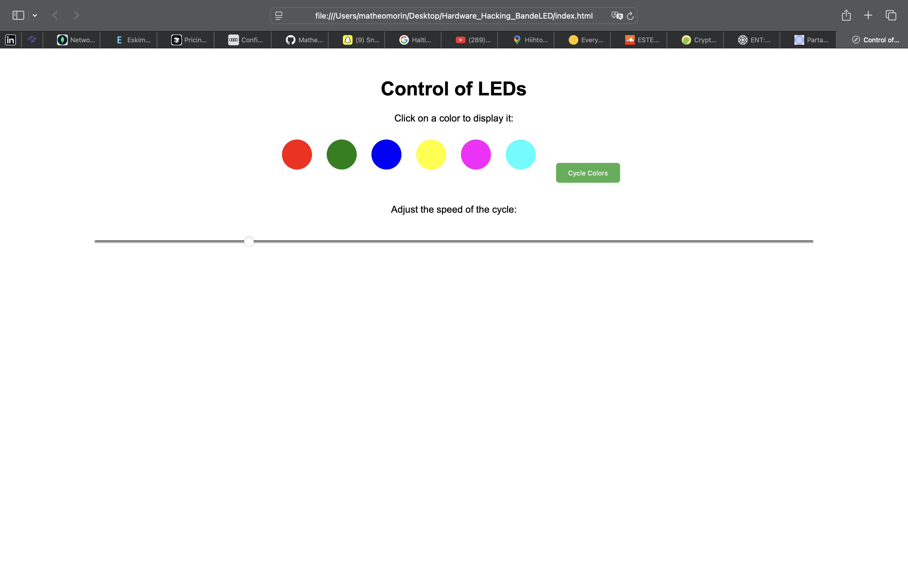

# Hardware_Hacking_BandeLED

This project was carried out by Léo Gloria and Mathéo Morin as part of the Hardware Hacking and Reverse Engineering course, taught by Christian Schuss at the University of Oulu, Finland.

## Project Overview

In this project, we adapted a non-addressable LED strip to make it controllable via WiFi. To achieve this, we used an ESP32 WiFi module that serves as a web server, allowing remote control of the LED strip from any device with a web browser.

*Figure 1: Interface web de contrôle de la bande LED*

## Hardware Components

### LED Strip Specifications
- Supply Voltage: 24V
- Current: 0.5A MAX
- RGB Control: 0V / 24V (each color channel requires either 0V or 24V)

### ESP8266 Specifications
- GPIO: 3.3V / 120mA

### MOSFET BS170G Specifications
- Maximum Voltage: 60V
- Gate Drive Voltage: 2 to 3V

## Technical Approach

### Hardware Implementation

Our approach began with analyzing the LED strip to identify the function of each wire:
- One wire for power supply (24V)
- Three wires for color control (Red, Green, Blue)

Since the ESP32 cannot directly drive the LED strip (due to voltage and current limitations), we implemented a MOSFET-based solution:

1. We used MOSFETs (BS170G) as switches to control each color channel
2. The ESP32 controls the gate of each MOSFET with its GPIO pins
3. When a GPIO pin is set HIGH, the corresponding MOSFET conducts, connecting the color channel to ground (0V)
4. When a GPIO pin is set LOW, the MOSFET stops conducting, allowing the color channel to remain at 24V

This setup allows us to control each color channel independently, creating various color combinations by turning different channels on or off.

### Software Implementation

We transformed the ESP32 into a web server that hosts a simple yet effective control interface:

1. The ESP32 creates a WiFi access point or connects to an existing network
2. It serves an HTML page with controls for the LED strip
3. Users can select specific colors or activate an automatic color cycle mode
4. The interface also includes a slider to adjust the speed of the color cycling

The web server processes HTTP requests with specific parameters to control the LED strip:
- `/color?red=X&green=Y&blue=Z` - Sets specific colors
- `/auto` - Activates automatic color cycling
- `/speed?value=N` - Adjusts the cycling speed

## Demonstration

The following video demonstrates the LED strip in operation, controlled through the web interface:

*Figure 2: Démonstration du contrôle de la bande LED (cliquez sur l'image pour voir la vidéo)*

## Conclusion

This project demonstrates how relatively simple hardware (an ESP32 and a few MOSFETs) can be used to add modern connectivity features to standard LED strips. The implementation allows for remote control from any device with a web browser, without requiring any specialized applications.

The hardware design is straightforward yet effective, using MOSFETs to bridge the voltage gap between the ESP32's low-voltage control signals and the LED strip's 24V requirements.

## Future Improvements

Possible enhancements to this project could include:
- Adding authentication to the web interface
- Implementing more advanced lighting patterns and effects
- Creating a mobile app for more convenient control
- Adding voice control integration with smart home systems
